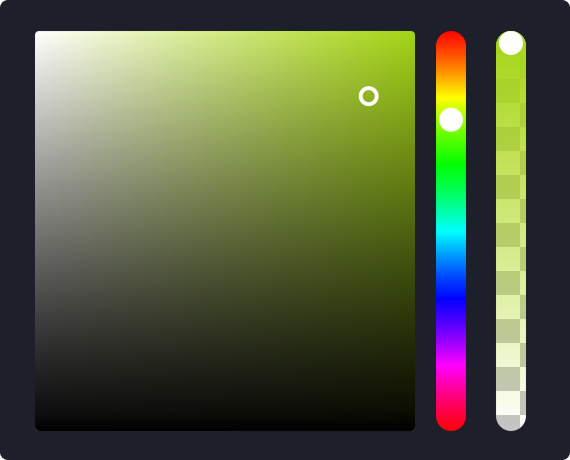

# 🎨 KMP Kolor Picker

A customizable color picker component for Compose Multiplatform with hue slider, alpha slider and 2D color selection.


<div align="center">

</div>

## Supported platforms

| Platform | Support |
|----------|---------|
| Android  | ✅       |
| iOS      | ✅       |
| Desktop  | ✅       |
| Web      | ✅       |

## Installation


```kotlin
repositories {
    mavenCentral()
}

dependencies {
    implementation("com.kborowy:kolor-picker:<latest-version>")
}
```

## Usage

```kotlin
var selectedColor by remember { mutableStateOf(Color(red = 120, green = 194, blue = 87)) }

KolorPicker(
    initialColor = selectedColor,
    onColorSelected = { selectedColor = it },
    pickerConfig = PickerConfig.Default,
    alphaTrackConfig = TrackConfig.Default,
    hueTrackConfig = TrackConfig.Default,
    modifier = Modifier.width(250.dp).height(200.dp),
)
```

### Custom configuration

```kotlin
KolorPicker(
    initialColor = selectedColor,
    onColorSelected = { selectedColor = it },
    pickerConfig = PickerConfig.Circle,
    alphaTrackConfig = TrackConfig.CircleFilled,
    hueTrackConfig = TrackConfig.CircleFilled,
    modifier = Modifier.width(250.dp).height(200.dp),
)
```

See [API page](api.md) for full specification. 


## License

```
Copyright 2025 Krzysztof Borowy

Licensed under the Apache License, Version 2.0 (the "License");
you may not use this file except in compliance with the License.
You may obtain a copy of the License at

   http://www.apache.org/licenses/LICENSE-2.0

Unless required by applicable law or agreed to in writing, software
distributed under the License is distributed on an "AS IS" BASIS,
WITHOUT WARRANTIES OR CONDITIONS OF ANY KIND, either express or implied.
See the License for the specific language governing permissions and
limitations under the License.
```
